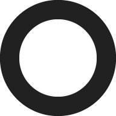

<p align="center">
  
</p>
<p align="center", style="font-size:60px;">
  <b>Material Lightmeter</b>
</p>

## Backstory

Some time ago I've started developing the [Material Lightmeter](https://play.google.com/store/apps/details?id=com.vodemn.lightmeter&hl=en&gl=US) app. Unfortunately, the last update of this app was almost a year prior to creation of this repo. So after reading some positive review on Google Play saying that "this is an excellent app, too bad it is no longer updated", I've decided to make an update and also make this app open source. Maybe someone sometime will decide to contribute to this project.

But as the existing repo contained some sensitive data, that I've pushed due to lack of experience, I had to make a new one. And if creating a new repo, why not rewrite the app from scratch?)

Without further delay behold my new Lightmeter app inspired by Material You (a.k.a. M3)

## Build

```
flutter build apk --flavor dev --dart-define cameraPreviewAspectRatio=2/3
flutter build apk --flavor dev --dart-define cameraPreviewAspectRatio=2/3 
```