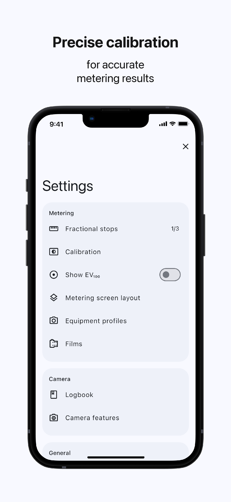
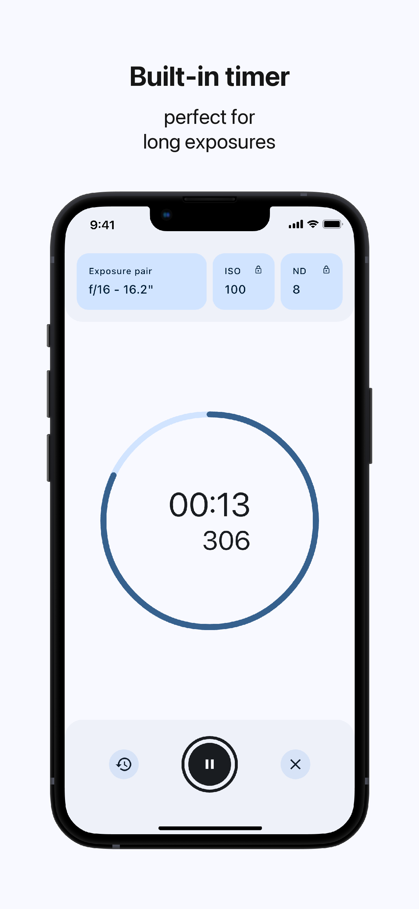
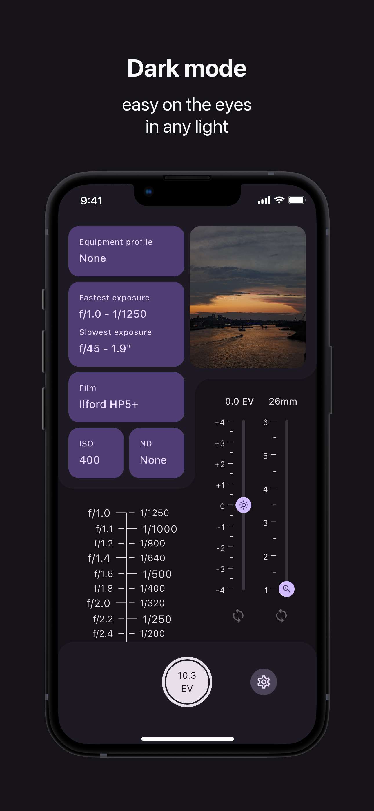

<div align="right">
  <details>
    <summary >🌐 Language</summary>
    <div>
      <div align="center">
        <a href="https://openaitx.github.io/view.html?user=vodemn&project=m3_lightmeter&lang=en">English</a>
        | <a href="https://openaitx.github.io/view.html?user=vodemn&project=m3_lightmeter&lang=zh-CN">简体中文</a>
        | <a href="https://openaitx.github.io/view.html?user=vodemn&project=m3_lightmeter&lang=zh-TW">繁體中文</a>
        | <a href="https://openaitx.github.io/view.html?user=vodemn&project=m3_lightmeter&lang=ja">日本語</a>
        | <a href="https://openaitx.github.io/view.html?user=vodemn&project=m3_lightmeter&lang=ko">한국어</a>
        | <a href="https://openaitx.github.io/view.html?user=vodemn&project=m3_lightmeter&lang=hi">हिन्दी</a>
        | <a href="https://openaitx.github.io/view.html?user=vodemn&project=m3_lightmeter&lang=th">ไทย</a>
        | <a href="https://openaitx.github.io/view.html?user=vodemn&project=m3_lightmeter&lang=fr">Français</a>
        | <a href="https://openaitx.github.io/view.html?user=vodemn&project=m3_lightmeter&lang=de">Deutsch</a>
        | <a href="https://openaitx.github.io/view.html?user=vodemn&project=m3_lightmeter&lang=es">Español</a>
        | <a href="https://openaitx.github.io/view.html?user=vodemn&project=m3_lightmeter&lang=it">Italiano</a>
        | <a href="https://openaitx.github.io/view.html?user=vodemn&project=m3_lightmeter&lang=ru">Русский</a>
        | <a href="https://openaitx.github.io/view.html?user=vodemn&project=m3_lightmeter&lang=pt">Português</a>
        | <a href="https://openaitx.github.io/view.html?user=vodemn&project=m3_lightmeter&lang=nl">Nederlands</a>
        | <a href="https://openaitx.github.io/view.html?user=vodemn&project=m3_lightmeter&lang=pl">Polski</a>
        | <a href="https://openaitx.github.io/view.html?user=vodemn&project=m3_lightmeter&lang=ar">العربية</a>
        | <a href="https://openaitx.github.io/view.html?user=vodemn&project=m3_lightmeter&lang=fa">فارسی</a>
        | <a href="https://openaitx.github.io/view.html?user=vodemn&project=m3_lightmeter&lang=tr">Türkçe</a>
        | <a href="https://openaitx.github.io/view.html?user=vodemn&project=m3_lightmeter&lang=vi">Tiếng Việt</a>
        | <a href="https://openaitx.github.io/view.html?user=vodemn&project=m3_lightmeter&lang=id">Bahasa Indonesia</a>
      </div>
    </div>
  </details>
</div>


# Table of contents

- [Table of contents](#table-of-contents)
- [Backstory](#backstory)
- [Screenshots](#screenshots)
- [Development](#development)
- [Support](#support)
- [iOS Limitations](#ios-limitations)

# Backstory

Some time ago I've started developing the [Material Lightmeter](https://play.google.com/store/apps/details?id=com.vodemn.lightmeter&hl=en&gl=US) app. Unfortunately, the last update of this app was almost a year prior to creation of this repo. So after reading some positive review on Google Play saying that "this is an excellent app, too bad it is no longer updated", I've decided to make an update and also make this app open source. Maybe someone sometime will decide to contribute to this project.

But as the existing repo contained some sensitive data, that I've pushed due to lack of experience, I had to make a new one. And if creating a new repo, why not rewrite the app from scratch?

Without further delay behold my new Lightmeter app inspired by Material You (a.k.a. M3)

# Screenshots

<p float="center">
  
  
  
  
  
</p>

# Development

### 1. Install Flutter

To build this app you need to install Flutter 3.24.5 stable. [How to install](https://docs.flutter.dev/get-started/install).

### 2. Project setup

#### Restore git-ignored files:

For macOS you can just run the following script:

```console
sh scripts/setup_fork.sh
```

Or create the files manually using the contents from the script.

#### Get dependencies

> If you are using VSCode, you can open the workspace like so: _File -> Open Workspace from File -> m3_lightmeter.code-workspace_. Otherwise you have to run `flutter pub get` command from the iap folder.

Then you can fetch all the neccessary dependencies and generate translation files by running the following commands:

```console
flutter pub get
flutter pub run intl_utils:generate
```

### 3. Build

- Checkout [Build .apk](.github/workflows/build_apk.yml) workflow for Android
- Checkout [Build .ipa](.github/workflows/build_ipa.yml) workflow for iOS

# Support

To report a bug or suggest a new feature open a new [issue](https://github.com/vodemn/m3_lightmeter/issues). To contribute to the project feel free to open a Pull Request, but you need to follow this [style guide](doc/style_guide.md).

In case you have any other questions please contact me via [email](mailto:contact.vodemn@gmail.com?subject="Lightmeter").

# iOS Limitations

A list of features, that Android version of the app has and that iOS does not.

## Incident light metering

Apple does not provide API for reading Lux stream form the ambient light sensor. Lux can be calculated based on front camera image stream, but this would be a reflected light. So there is no way incident light metering can be implemented on iOS.

## Volume buttons action

This can be [implemented](https://stackoverflow.com/questions/70161271/ios-override-hardware-volume-buttons-same-as-zello) but the app will be rejected due to [2.5.9](https://developer.apple.com/app-store/review/guidelines/#software-requirements)
